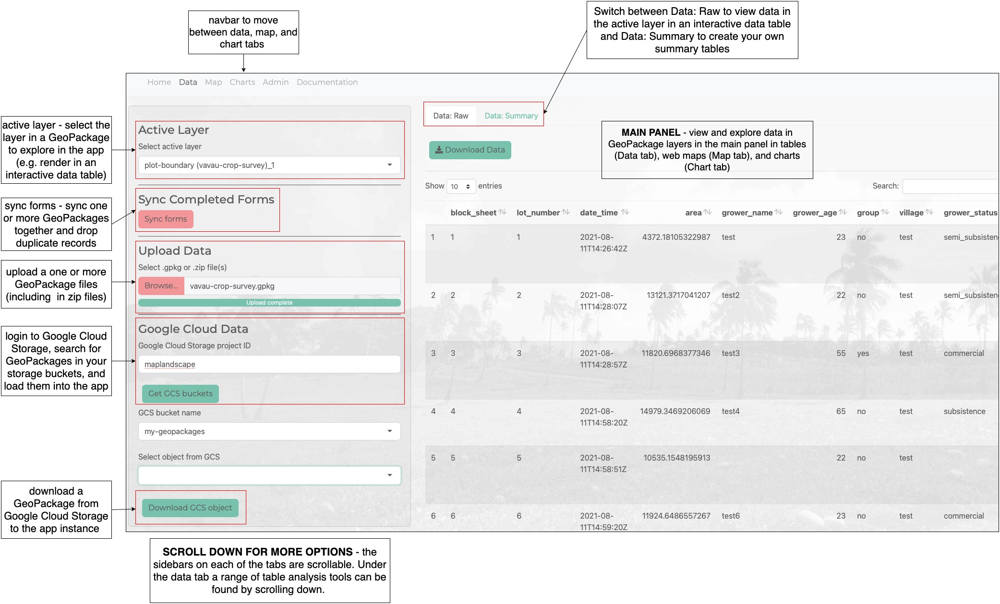
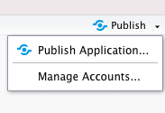

# maplandscape


## Overview

A package that provides functions for building [Shiny](https://shiny.rstudio.com) dashboard applications to explore and visualise spatial layers in GeoPackages.

A pre-built [Shiny](https://shiny.rstudio.com) application is provided with this package which uses these functions and provides tools for:

* Syncing data stored in multiple GeoPackages.
* Exploring GeoPackage layers in interactive tables, web maps, and charts.
* Options for customising and styling charts and web maps. 
* Combining layers using spatial and non-spatial joins.
* Generating summary tables through group-by and summarise operations. 
* Generating new layers and add new columns to existing layers. 
* Authenticated access to GeoPackages stored in Google Cloud Storage.
* Admin mode for data cleaning and editing geometries and attribute values.

This package was developed as part of the [Livelihoods and Landscapes](https://livelihoods-and-landscapes.com) project which is developing tools and approaches to map diverse agricultural landscapes. The initial motivation for developing the package and Shiny application was to provide analysts with tools to analyse and visualise geospatial data collected 'in the field' using the [QField](https://qfield.org) mobile GIS application. 

## Use

The vignettes provide a range of tutorials for exploring and analysing data in GeoPackages using the maplandscape app. These include tutorials demonstrating how to perform a range of table analysis operations (add columns, filter rows, join tables), spatial analysis operations (spatial join - combine spatial layers), style your own web maps, and create a range of charts to visualise data in your GeoPackages. 

The figure below provides an overview of the UI for the maplandscape app provided with this package. Each of the main tabs in the app have a similar layout with a scrollable sidebar containing options for loading GeoPackages into the app, selecting a layer in a GeoPackage, querying and analysing GeoPackage data, and styling charts and web maps. The data in GeoPackage layers is rendered in the main panel of the page in either table, web map, or chart formats.  



### Local R Package

Install as an R package:

```
install.packages("devtools")
devtools::install_github("livelihoods-and-landscapes/maplandscape")
```

Build and customise your own Shiny application using functions provided by maplandscape or launch a pre-built application:

```
dir <- system.file("app", package = "maplandscape")
setwd(dir)
library(maplandscape)
shiny::shinyAppDir(".")
```

The will launch a pre-built Shiny application to explore data in GeoPackages from the `inst/app` sub-directory of the package. 

### shinyapps.io

RStudio offers a free-tier hosting service for Shiny apps. Sign up at [shinyapps.io](https://www.shinyapps.io). 

Follow the above commands to launch maplandscape (or your custom Shiny application). In the top-right of the application window you will see a *Publish* button, click this button and follow the prompts to deploy the application to [shinyapps.io](https://www.shinyapps.io).



RStudio provide a detailed tutorial for deploying apps to shinyapps.io [here](https://shiny.rstudio.com/articles/shinyapps.html).


### Docker and host in the cloud

Clone the maplandscape GitHub repo:

```
git clone https://github.com/livelihoods-and-landscapes/maplandscape.git

cd maplandscape
```

There is a sub-directory named `docker`. This contains a `Dockerfile` that lists instructions that are used to build a docker image.

```
cd docker

docker build -t maplandscape .
```

The image is based on the `rocker/shiny:latest` image which includes [Shiny Server](https://www.rstudio.com/products/shiny/shiny-server/?_ga=2.240850435.1437924050.1628840494-908324396.1627896044) to host the maplandscape Shiny application. Shiny Server serves apps out of the `srv/shiny-server/` directory; building the docker image will install all the R packages required to run maplandscape, install the maplandscape package from github, and copy an `app.R` script into `srv/shiny-server/app` which contains the commands to launch maplandscape. 

A customised `shiny-customised.config` file is used to set the `app_dir` to  the app directory where Shiny Server will launch and serve the app from. 

Launch the docker container:

```
docker run -p 3838:3838 maplandscape
```

You can find more information about [Shiny Server](https://www.rstudio.com/products/shiny/shiny-server/?_ga=2.240850435.1437924050.1628840494-908324396.1627896044) [here](https://shiny.rstudio.com/articles/shiny-server.html), at its [GitHub repo](https://github.com/rstudio/shiny-server), and following this [tutorial](https://deanattali.com/2015/05/09/setup-rstudio-shiny-server-digital-ocean/). 

Please see the vignette Deploy: Google Cloud for a tutorial demonstrating how to deploy a containerised Shiny application on Google Cloud Run. 
