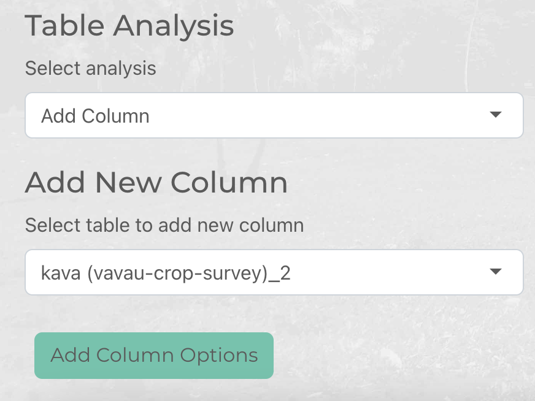
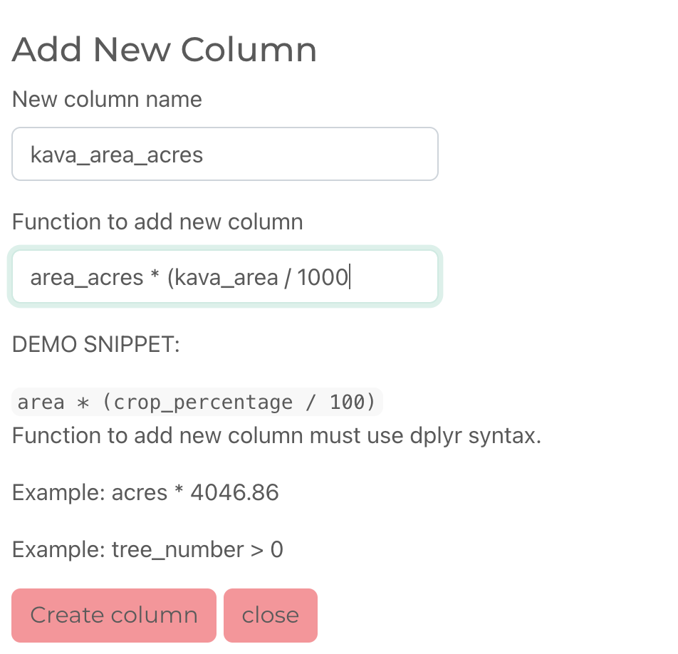

```{r, include = FALSE}
knitr::opts_chunk$set(
  collapse = TRUE,
  comment = "#>"
)
```

maplandscape's Shiny app provides tools for adding new columns to layers in GeoPackages as a function of values in existing columns. This is based on dplyr's [mutate](https://r4ds.had.co.nz/transform.html#add-new-variables-with-mutate) function.

To add a column to a layer in the app scroll down to the *Table Analysis* section of the side bar and select *Add Column* under the *Select analysis* dropdown list.



Choose the layer that you wish to add a column to and click the *Add Column Options* button. 

This will bring up a modal popup window where you can enter the name of the column you wish to create and specify how to compute values in this new column. Standard [R](https://r4ds.had.co.nz/transform.html#add-new-variables-with-mutate) and [dyplr](https://dplyr.tidyverse.org) syntax can be used here. For example, `time_minutes * 60` would convert numeric values representing minutes in a `time_minutes` column to a new set of values in seconds.  



Depending on whether the result of the `add_column` operation was successful or not you will get a success or error notification. You can select the layer that you added a column to in the *Select active layer* widget to inspect the new column.
