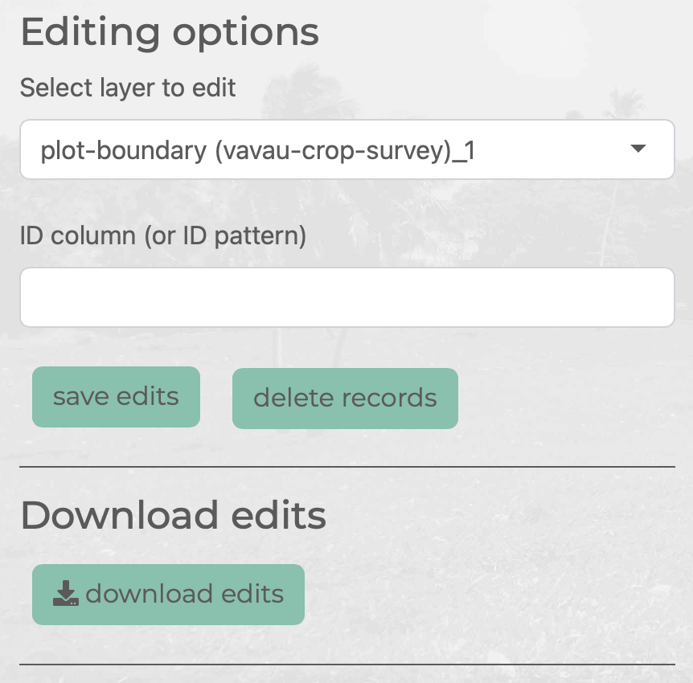
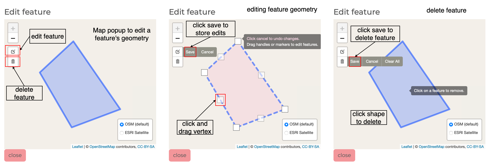
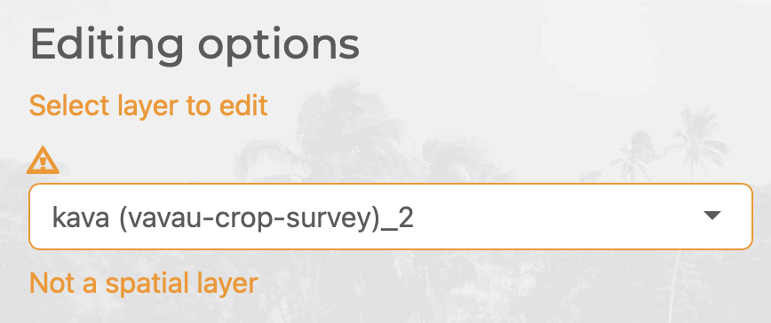
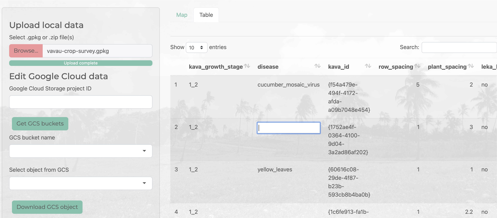
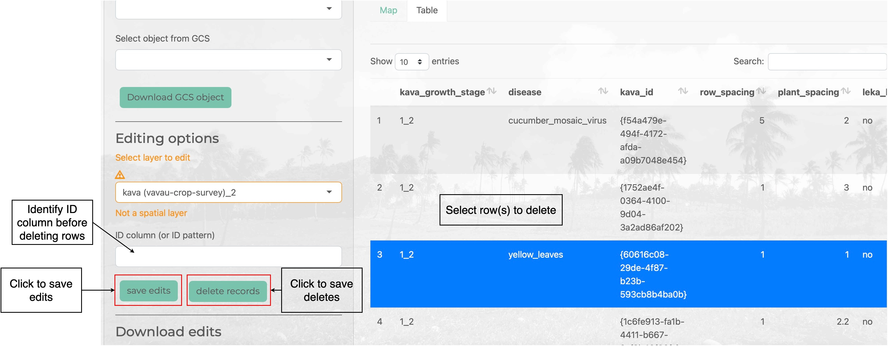

```{r, include = FALSE}
knitr::opts_chunk$set(
  collapse = TRUE,
  comment = "#>"
)
```

The *Admin* tab provides tools for data cleaning and editing data in GeoPackage layers. You can use the *Admin mode* to edit the geometries of features using a map interface or edit attribute records using an editable data table. 

## Load Data

You can load GeoPackages into the *Admin* tab through the *Upload local data* file input (uploading local GeoPackages) or, if you are signed in with your Google identity, loading a file from your Google Cloud storage - click the *Download GCS object* button to load GeoPackage from Google Cloud Storage into the app in admin mode. 


## Editing Options

Use the *Select layer to edit* dropdown list to select the layer in the GeoPackage that you'd like to edit. If the layer is spatial you will be able to edit in the map interface (i.e. adjust the feature's geometry) or in the table interface (i.e. edit feature attribute values)



### Edit Shapes

To edit a feature's geometry make sure the layer selected is spatial. Then click on the feature you wish to edit in the map. This will bring up a popup map zoomed in on the feature. Click on the edit icon to edit a feature's geometry (either move vertices or move the shape). Click on the delete icon to delete the feature. 



If you have selected a non-spatial layer you will get a warning around the *Select layer to edit* dropdown list.



### Edit Tables

Clicking on the *Table* tab will render the active layer in an editable data table. You can click on a cell and enter or edit values. The app will check that the value you enter can be converted to the column type before applying the edit. 



You can select one or more rows and delete them. To delete rows you need to specify an ID column (or ID suffix pattern common across ID columns in all layers in the GeoPackage - e.g. `_id`). This allows associated records for the deleted row to also be dropped from other tables in the GeoPackage. 

As you edit and delete rows in GeoPackage layers, these edits are applied to a temporary copy of the layer in-memory. To apply these edits or deletes back to the GeoPackage file loaded into the app instance click either *save edits* or *delete records*.



## Save Edits

To download a copy of your edited GeoPackage click *download edits*. This will download the edited GeoPackae and a log of edits applied to a .zip file. 

If you are signed in with Google, you will see a *Sync edits to Google Cloud Storage* section in the sidebar (the Google login button is under the *Data* tab). You can enter the URI for an API where you can POST your edits to which can handle your edited GeoPackage (e.g. update your Google Cloud Storage with latest version of the GeoPackage with edits applied or data cleaned). An example of an app that can handle POSTing edited GeoPackages in maplandscape and store the edited or cleaned GeoPackage is [here](https://github.com/livelihoods-and-landscapes/syncmaplandscape): a [FastAPI](https://fastapi.tiangolo.com) app which creates backup of GeoPackages in Google Cloud Storage before saving the edited data. 
