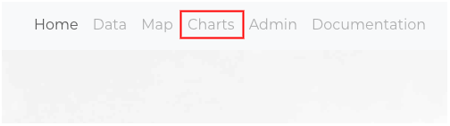
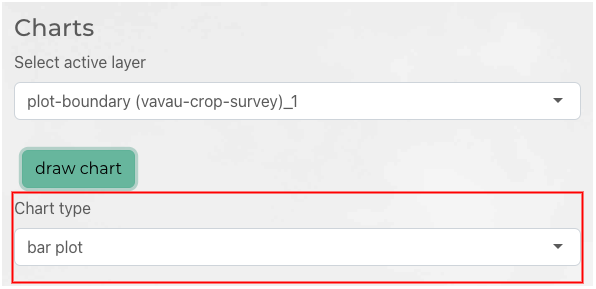
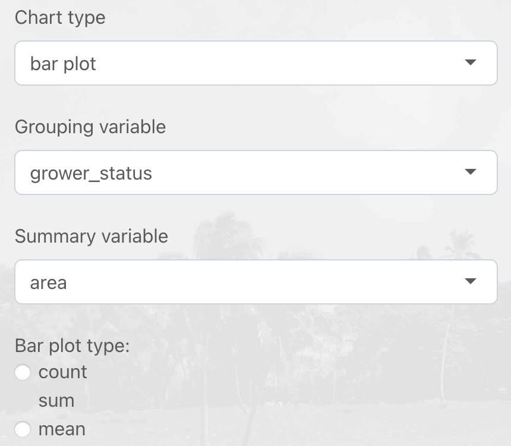
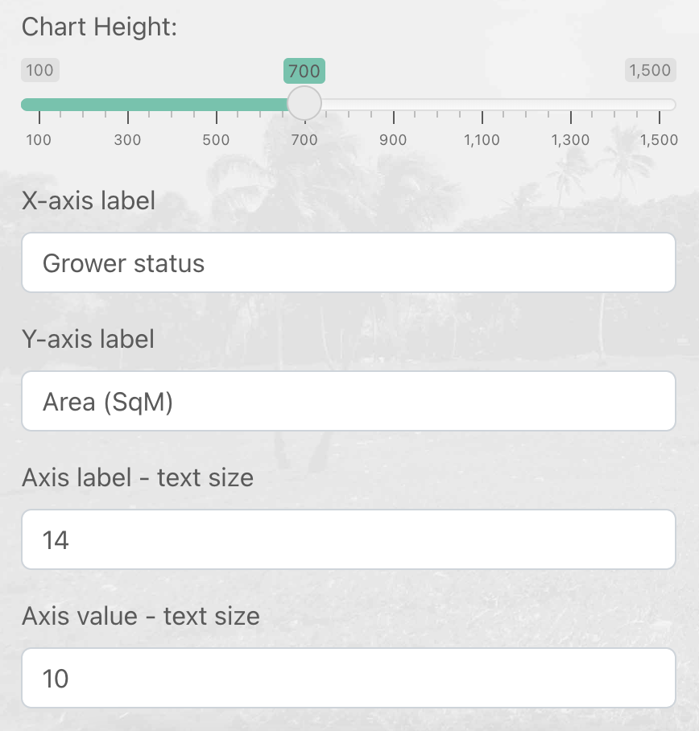
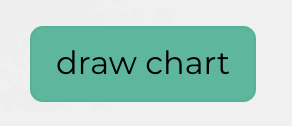
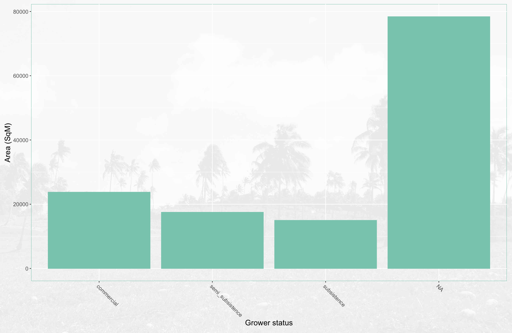
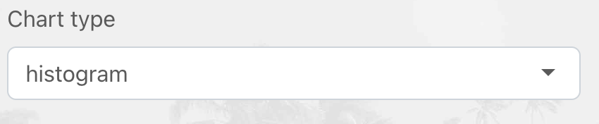
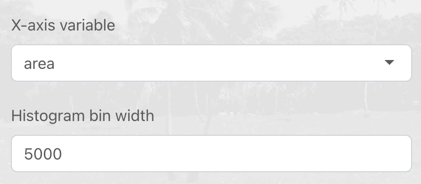
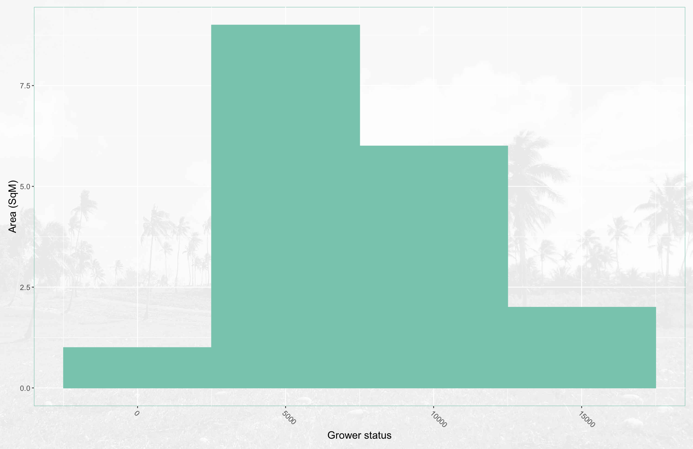

```{r, include = FALSE}
knitr::opts_chunk$set(
  collapse = TRUE,
  comment = "#>"
)
```

Under the *Charts* tab are a range of tools to generate and style charts to visualise patterns in data loaded into the Shiny application. The charts are generated using the [ggplot](https://ggplot2.tidyverse.org) package and can be exported as a .png file. For further information about best-practice for using charts [Fundamentals of Data Visualisation](https://clauswilke.com/dataviz/) is recommended. 

## Barplots

[Barplots](https://clauswilke.com/dataviz/visualizing-amounts.html) can be used to visualise amounts for a set of groups or categories. maplandscape uses ggplot's [geom_col](https://ggplot2.tidyverse.org/reference/geom_bar.html) to generate barplots. 

Head to the *Charts* tab in the navbar and select the layer that contains columns that you want to visualise on a barplot. 



Select *bar plot* from the dropdown list of available *Chart type*s.



Select the *Grouping variable* and the *Summary variable*; the *Grouping variable* specifies the set of groups that amounts of the of *Summary variable* will be computed for. You can select from *count*, *sum*, or *mean* to compute amounts of the *Summary variable* per-group. 



There are a range of other chart styling options you can set. You can use the slider to adjust the chart height to fill your display or requirements for export. There are also options to specify axis labels and font sizes. 



Click the *draw chart* button to render the barplot. 





## Histograms

Histograms are used to visualise the distribution of a continuous variable. Under the *Chart type* dropdown list select *Hisotgram*.



Use the *X-axis variable* dropdown list to select the continuous variable to generate a histogram for and enter a *Histogram bin width* to specify the width of bins for the histogram.



Click the *draw chart* button to render the histogram. 




## Scatter Charts

Scatter charts are used to visualise the relationship (or correlation) between two variables. 
