```{r, include = FALSE}
knitr::opts_chunk$set(
  collapse = TRUE,
  comment = "#>"
)
```

# Exploring Cropping Systems in maplandscape

This vignette will demonstrate how to use maplandscape to explore cropping systems and agricultural landscapes on the island group of Vava'u, Tonga, in the Pacific Ocean. It will provide a comprehensive overview of maplandscape's features and how to navigate around the user interface. 

### Data

A copy of the data to use for this vignette is available <a href="https://storage.googleapis.com/test-geopackages/demo-crop-survey.gpkg" target="_blank">here</a>. 

This is a demo data set of crop survey data collected by the Ministry of Agriculture, Food, Forests, and Fisheries, Government of Tonga, using <a href="https://qfield.org" target="_blank">QField</a> mobile GIS. It is a GeoPackage file, which is a file-based relational database containing a spatial table storing field outlines as geometry objects and a number of non-spatial tables storing attributes about cropping practices in each field. 

You'll also need a copy of the village boundaries for Vava'u, which is available <a href="https://storage.googleapis.com/test-geopackages/vavau-village-boundaries.gpkg" target="_blank">here</a>.

The goal of this vignette is to:

* Create a web map visualising kava cropping systems.
* Generate bar plots showing the area and plant number of kava cropping systems in each village.
* Generate a summary table of the area and plant number of kava cropping systems in each village.

Along the way you will learn how to use a range of data processing and GIS operations in maplandscape to perform custom analyses, extract insights from geospatial data, and generate outputs for reporting and decision making. 

### A little context

Kava is a shrub plant that is harvested for its roots which are used to make a drink which has sedative and anesthetic effects. It is a destructive harvest with the entire shrub pulled out of the ground to access the roots. This exposes and disturbs the soil, which increases the risk of soil erosion during intense rain events that are common in Vava'u. In recent years, in response to market demand, large areas of Vava'u have been allocated to kava cultivation. This is at the expense of crops that are important for food security and tree cover. Landscape managers in Vava'u are keen to track changes in cropping systems and have access to accurate data on the state of kava cultivation to guide landscape management activities. 

# Getting started

Head to a live version of maplandscape <a href="https://livelihoods-and-landscapes.shinyapps.io/demo/" target="_blank">here</a>.

The image below is a screen grab of the maplandscape user interface highlighting the main widgets and tools to be aware of. In particular, take note of the navbar at the top of the screen that lets you move between tabs for exploring your data in table, web map, or chart formats. 

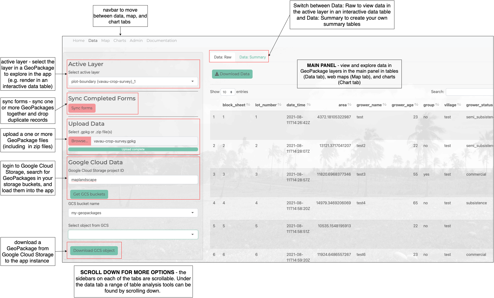

## Upload Data

Let's start by loading the demo crop survey data (in <em>demo-crop-survey.gpkg</em> that you downloaded earlier) into maplansdcape. Head to the sidebar in the <em>Data</em> tab and look for the <em>Upload Data</em> section. Click <em>Browse</em> and scroll to where you downloaded <em>demo-crop-survey.gpkg</em> and load it into maplandscape. You can also drag and drop <em>demo-crop-survey.gpkg</em> onto the white box next to the <em>Browse</em> button. If all goes well, you should see a green progress bar beneath the upload widget and then a small success message. 

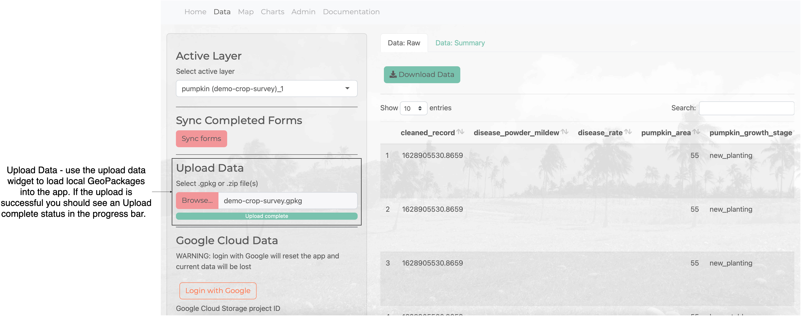

## Viewing Layers in a GeoPackage

Once the file has been uploaded, it will unpack the layers in the GeoPackage and make them available to you under the <em>Active Layer</em> section at the top of the sidebar. You should see layer names such as <em>pumpkin (demo-crop-survey)_1</em>, <em>tobacco (demo-crop-survey)_1</em>, and so on. The layer names have the format of <em>layer name (GeoPackage name)_layer index</em>. The <em>layer index</em> is a numeric index to help you keep track of layer-GeoPackage combinations in case you load two GeoPackages with the same structure into the app. 

You should see the selected layer rendered in the data table display in the main panel. Explore changing the selected <em>Active layer</em> and seeing a new layer rendered in the data table display (e.g. select the <em>kava (demo-crop-survey)_1</em> layer and you should see column headers for <em>akau_hina</em>, <em>akau_kula</em>, and <em>leka_hina</em> which correspond to kava varieties).

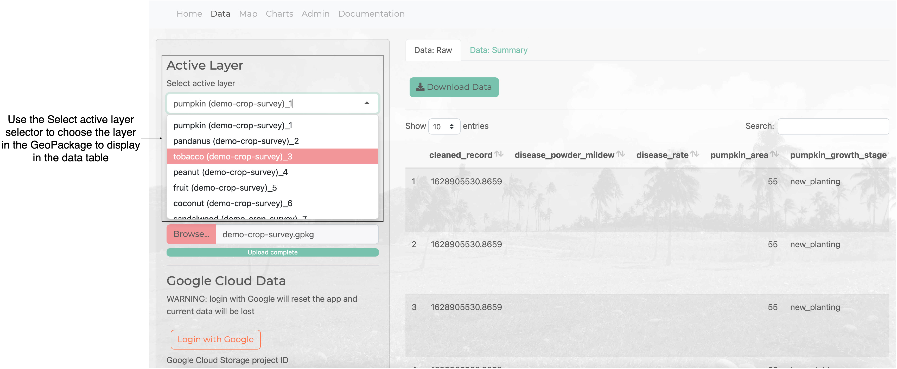

Keep the layer <em>kava (demo-crop-survey)_1</em> selected. Let's explore some of the tools in the data table display for exploring your data. The <em>kava_area</em> column records the proportion of a field that is cultivated with kava. Let's sort our data by <em>kava_area</em>. Next to the <em>kava_area</em> column header you should see and up and a down arrow. Clicking on these arrows will sort the rows in the table by the values in these columns. 

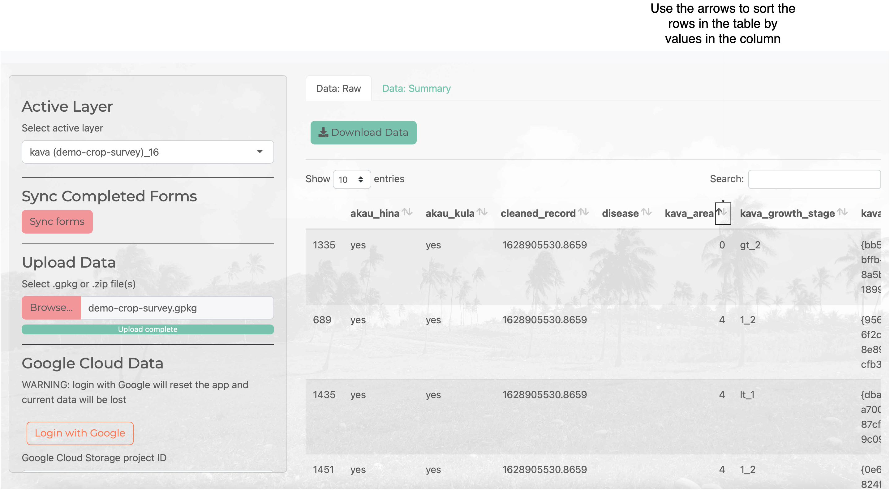

If you scroll to the bottom of the table, you can see that the first 10 rows of the table are displayed. You can scroll through the rows using the numbers or the <em>Previous</em> and <em>Next</em> buttons. 

You can also choose to display more records in the table using the <em>Show XX entries</em> selector.


You can also use the <em>Search</em> widget to search for matching records in the table. For example, if we start typing `gt_2` into the <em>Search</em> bar all records in the kava table with <em>kava_growth_stage</em> equal to `gt_2` will be rendered. 

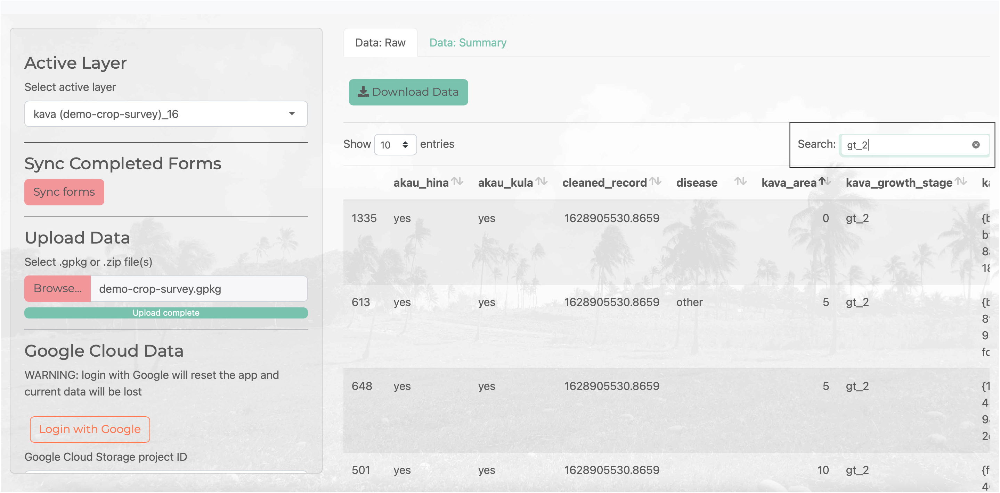

## The Map tab

We can also explore spatial layers in a GeoPackage on a web map. Head to the <em>Map</em> tab in the navbar. Your <em>Map</em> display should look like the below image. There sidebar contains widgets that can be used to style data that is rendered on the web map. 

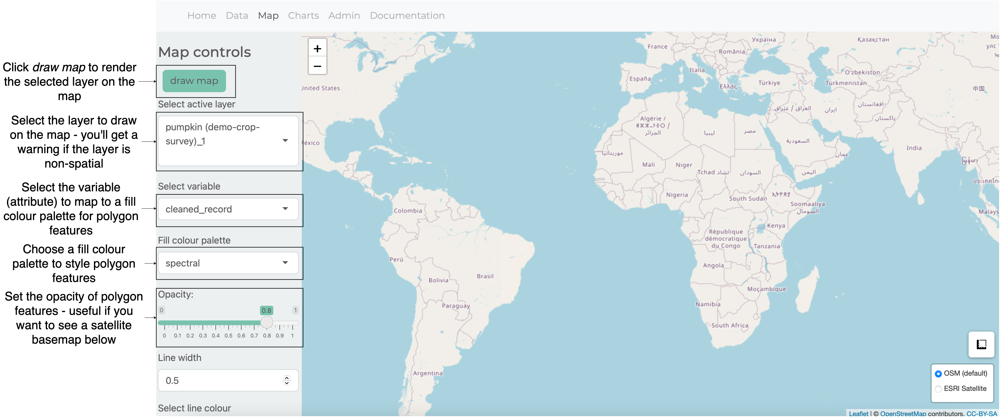

There is only one spatial layer in the <em>demo-crop-survey.gpkg</em> GeoPacakge - the <em>plot-boundary (demo-crop-survey)_17</em> layer. Under the <em>Select active layer</em> selector choose <em>plot-boundary (demo-crop-survey)_17</em> and let's map the area of each polygon to a fill colour palette - under <em>Select variable</em> select <em>area_acres</em>. Let's choose the <em>red - yellow - green</em> <em>Fill colour palette</em>. When you have made these selections, click the <em>draw map</em> button at the top of the sidebar. This should render the <em>plot-boundary (demo-crop-survey)_17</em> layer on the web map in the main panel. All going well, your map display should look like the below image. If any of the features look funky, they've been jittered and distorted from the actual field geometries collected using QField. 

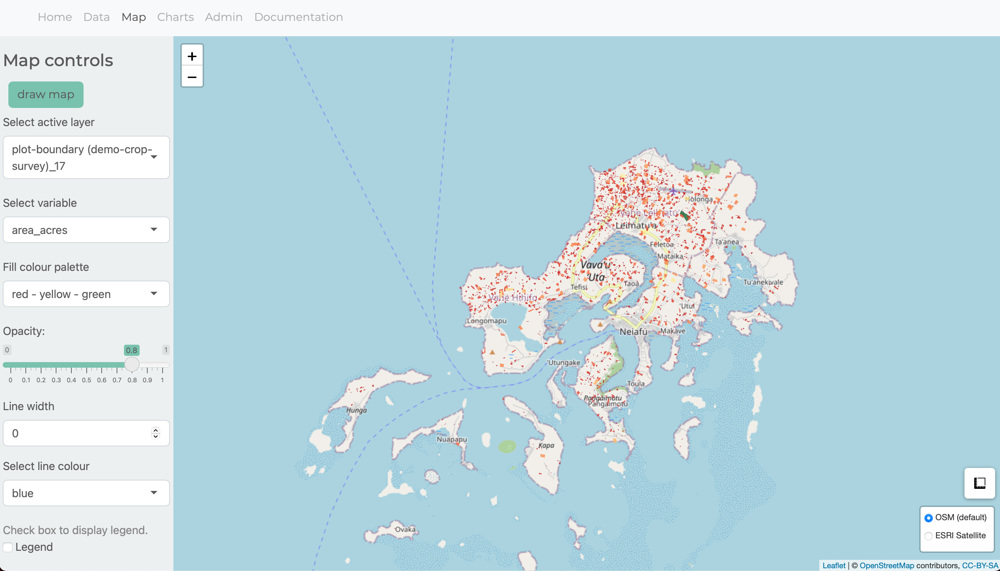

# Data Transformation

Often, data that's collected in-the-field needs to be processed and transformed (data wrangling) before it's ready for visualising, reporting, or providing insights that are relevant for decision making. maplandscape provides a range of tools for processing and transforming your spatial and non-spatial layers in a GeoPackage. 

## Joining Tables

As we stated at the beginning, we're interested in exploring kava-dominant cropping systems here. Head to the <em>Data</em> tab and select <em>kava (demo-crop-survey)_16</em> as the <em>Active layer</em>. This is a non-spatial layer (the Geometry object is empty). We want to attach the attributes about kava cultivation in the <em>kava (demo-crop-survey)_16</em> layer to a layer that stores the geometries for fields. 

The <em>plot-boundary (demo-crop-survey)_17</em> layer is a spatial table with field outlines stored in its geometry object. In the <em>kava (demo-crop-survey)_16</em> layer there is a variable called <em>kava_id</em> and in the <em>plot-boundary (demo-crop-survey)_17</em> layer there is a variable called <em>plot_id</em>. These variables are unique identifiers for fields and can be used to match records in the <em>kava (demo-crop-survey)_16</em> layer to records in the <em>plot-boundary (demo-crop-survey)_17</em> layer. In the sidebar, scroll down until you see the <em>Table Analysis</em> section. This provides a suite of tools for analysing spatial data. The tool we're after here is <em>Combine Tables</em>. The <em>Combine Tables</em> tool allows you to perform key-based joins on two related tables. A key is a variable (or set of variable) that uniquely identifies records in both tables and allows us to add records from one table to another by matching values in keys in both tables. When joining tables you have a left and right table. maplandscape lets you perform left and inner joins. In a left join, all rows in the left table are retained and matching records in the right table are appended to the left table. An inner join keeps only rows where there was match between the key variables in both tables. You can read more about the concepts involved in joining tables and working with keys <a href="https://r4ds.had.co.nz/relational-data.html#relational-data" target="_blank">here</a>.

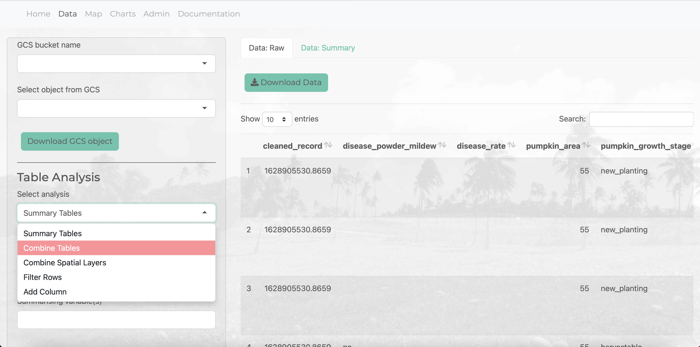

Let's perform an inner join to create a table that only has records for fields where kava is grown. Set up your <em>Combine Tables</em> as in the image below. Set the left table as <em>plot-boundary (demo-crop-survey)_17</em>, set the right table as <em>kava (demo-crop-survey)_16</em>, set the primary key as <em>plot_id</em>, and set the foreign key as <em>kava_id</em>, set the join type as <em>column - inner</em>, and give the output table a name (e.g. <em>kava_fields</em>). When you're ready, click the <em>Join</em> button. This should add the layer <em>kava_fields</em> to the <em>Active layer</em> selector. 

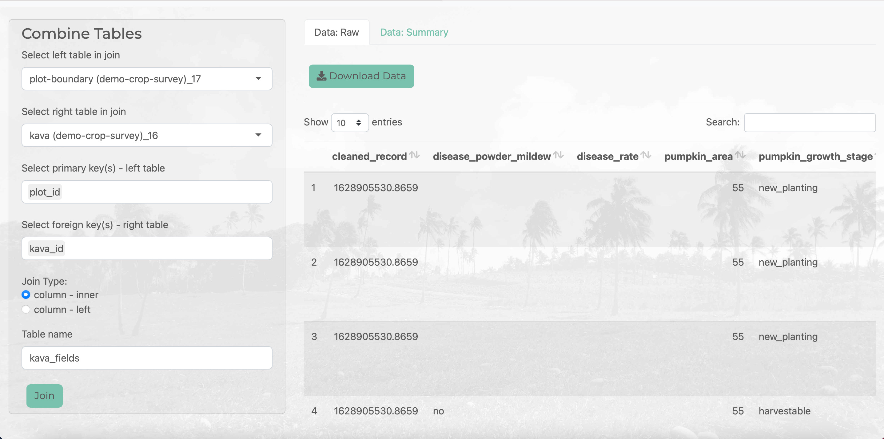

Explore <em>kava_fields</em> in the table display. It should have all the attributes from the <em>plot-boundary (demo-crop-survey)_17</em> layer and the <em>kava (demo-crop-survey)_16</em> layer.

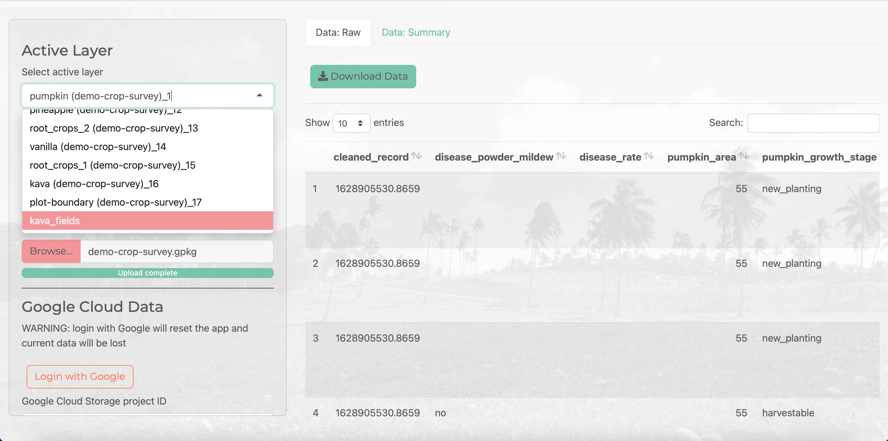

## Spatial Joins

We're also going to want to aggregate the area and plant number of kava in each village. This means we'll need to attach a column that tells us which village each kava field is in. Let's start by loading the <em>vavau-village-boundaries.gpkg</em> file into the app using the <em>Upload Data</em> tools in the sidebar. 

All going well, you should see a layer <em>vavau-village-boundaries (vavau-village-boundaries)_18</em> appear in the <em>Active layer</em> selector. Head to the <em>Map</em> tab and draw this layer on the map to see the village boundaries. 

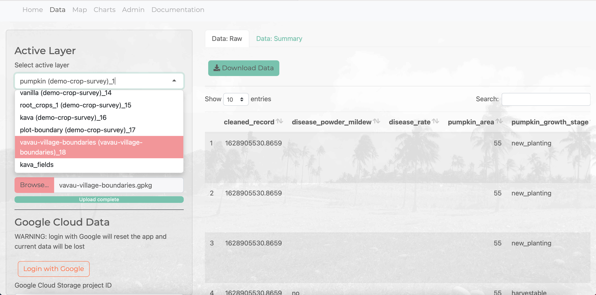

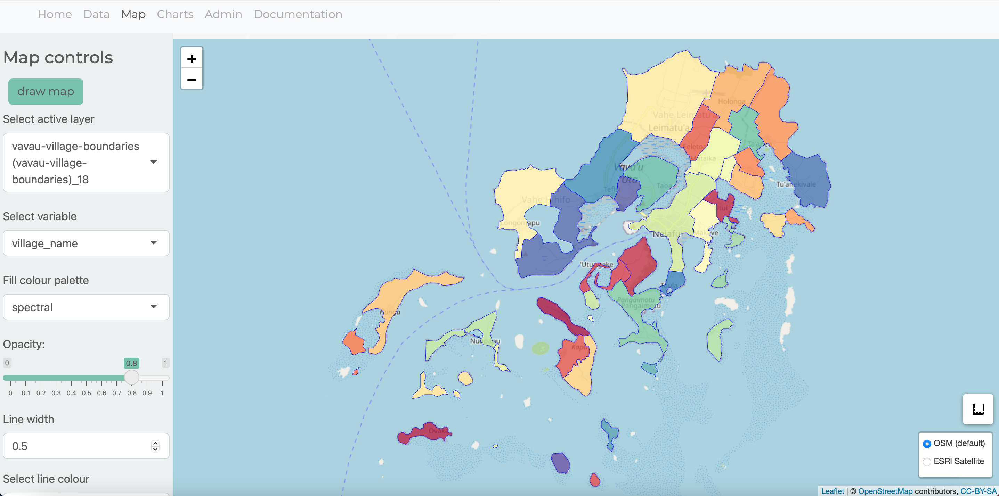

We're now ready use the <em>vavau-village-boundaries (vavau-village-boundaries)_18</em> layer to identify which village each kava field is in. We can use a spatial join to do this, attaching the <em>village_name</em> attribute in the <em>vavau-village-boundaries (vavau-village-boundaries)_18</em> layer to the <em>kava_field</em> table. A spatial join allows you to combine attributes from two spatial layers based upon the feature’s relationship in space. This will involve assigning attributes from the <em>vavau-village-boundaries (vavau-village-boundaries)_18</em> (e.g. village name, village id) to fields in <em>kava_fields</em> whose outline overlaps with the village extent.

In maplandscape features are joined based on the largest intersection (largest overlap) between two features <a href="https://r-spatial.github.io/sf/reference/st_join.html" target="_blank">sf's `st_join()`</a>. If 30% of a field overlapped with Village A and 70% of a field overlapped with Village B, the field would be assigned the attributes of Village B. Another way to think of this is: the field is getting the columns from the table associated with village boundaries with the values coming from the row in village boundaries table corresponding to the village with the largest overlap with the field.

The following diagram illustrates the process of performing a spatial join using the field-to-village example.

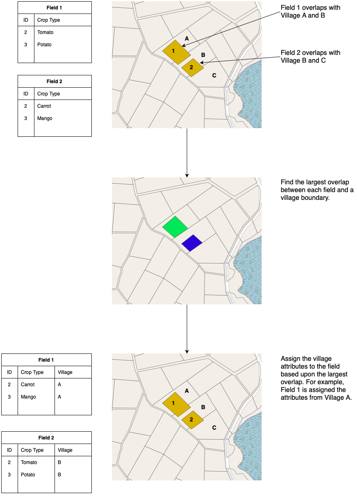

Head to the <em>Data</em> tab and the <em>Table Analysis</em> section in the sidebar. Select <em>Combine Spatial Layers</em> and set up the options as in the image below. For the left table select <em>kava fields</em>, for the right table select <em>vavau-village-boundaries (vavau-village-boundaries)_18</em>, for the <em>Join Type</em> select <em>spatial - inner</em>, and choose sensible table name such as <em>kava_fields_village</em>. Click the <em>Join</em> button. This should perform the spatial join and add <em>kava_fields_village</em> as a layer to the <em>Active layer</em> selector.

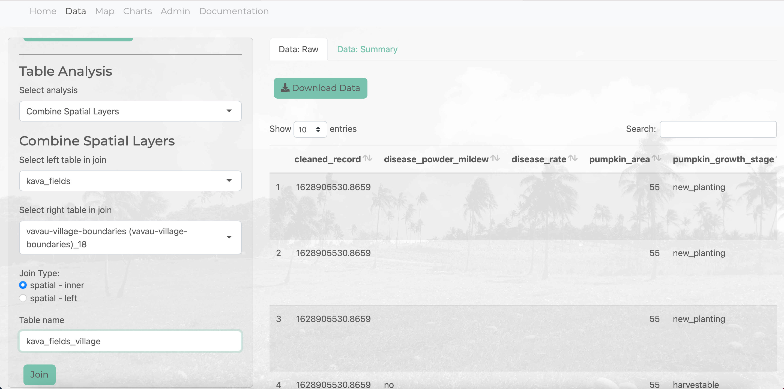

## Creating New Variables

A key task in transforming data ready for analysis and decision making is creating new columns that are functions of existing columns in our data. Under the <em>Table Analysis</em> section is an <em>Add Column</em> tool that allows us to create custom functions to create new columns in a layer. Let's write functions to compute the area of kava in each field in acres and to compute the number of kava plants in each field. 

Select the <em>Add Column</em> tool. The select the layer that we want to add a new column too - <em>kava_fields_village</em>. Click the <em>Add Column Options</em> button.

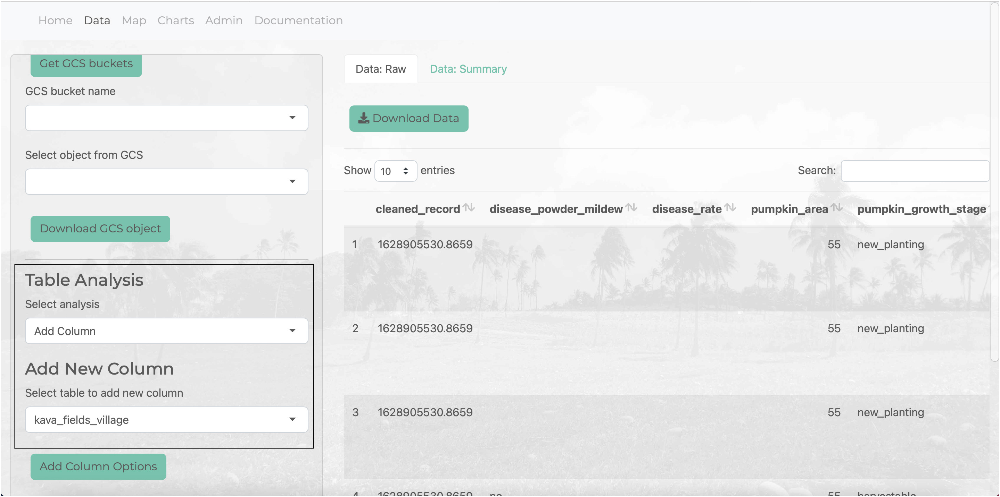

In the popup window, set the new column name as <em>kava_area_acres</em> and use this function to compute the area of kava cultivation in acres in each field: `area_acres * (kava_area / 100)`. The <em>area_acres</em> column is the area of the field in acres and the <em>kava_area</em> column is the percentage of a field covered in kava crops. This function is computing the area of kava cultivation in each field and will store the result in the column <em>kava_area_acres</em>. Click <em>Create column</em>.

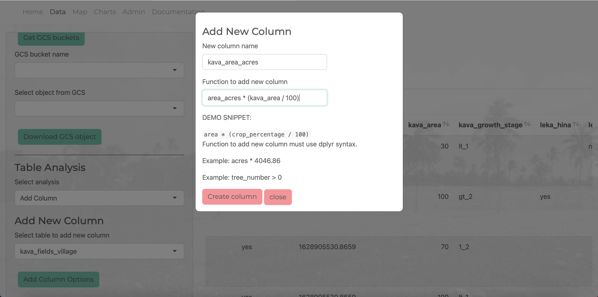

Display <em>kava_fields_village</em> in the table display and check to see that a column <em>kava_area_acres</em> has been appended to the far end. 


Let's create one more column that stores the number of kava plants in each field. There is a special in-built function called `plant_number()` in the app for this. Repeat the previous process of going to the <em>Add Column</em> tool and selecting <em>kava_fields_village</em>. This time set the new column name to <em>kava_plant_number</em> and the function as `plant_number(kava_area_acres, plant_spacing, row_spacing)`. This should have computed the number of kava plants in each field and stored the value in the column <em>kava_plant_number</em>.

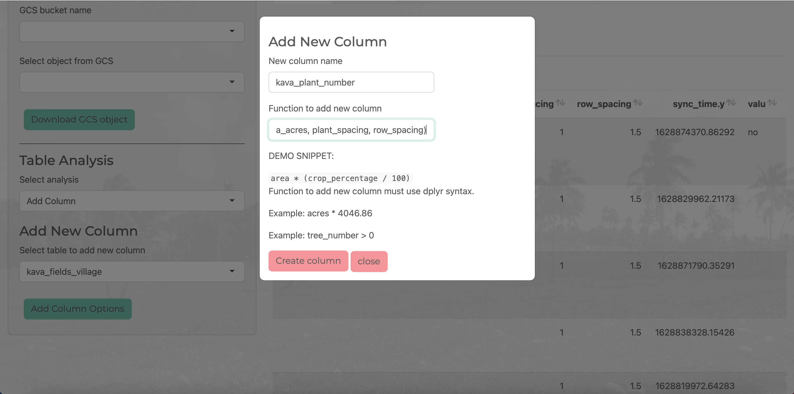

### Subsetting Data

As part of our data transformation tasks, we might want to create a new layer based on values in an existing layer. This is a subsetting task. Under the <em>Table Analysis</em> section is a <em>Filter Rows</em> tool that allows us specify a filter condition to subset rows from an existing layer and store them in a new layer. Let's create a new layer that stores only fields that are kava dominant (i.e. kava cultivation covered more than 50% of the field's area). 

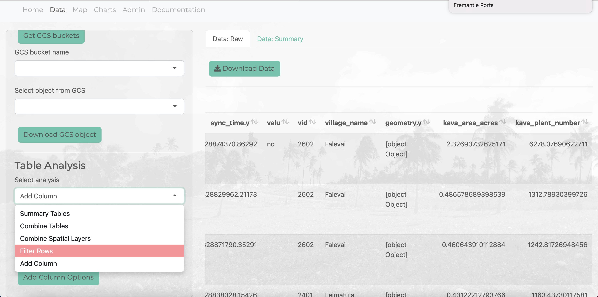

Under the <em>Filter Rows</em> tool, select the table to filter as <em>kava_fields_village</em> and click the <em>Filter Options</em> button.

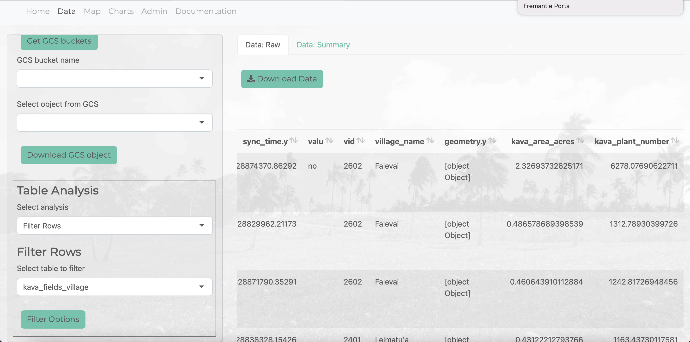

Let's set a condition to subset rows from the <em>kava_fields_village</em> layer keeping only rows that correspond to fields with greater than or equal to 50% kava coverage: `kava_area > 50`. Enter a new layer name to store the subsetted records (e.g. <em>kava_dominant_fields</em>). Click <em>Filter</em>. The new layer should be added to the <em>Active layer</em> selector.

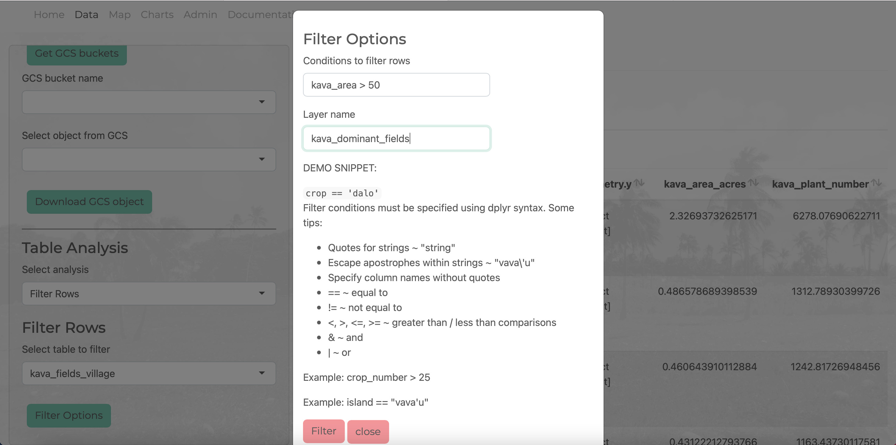

Let's check the filter operation worked OK. Head to the <em>Map</em> tab and draw the <em>kava_dominant_fields</em> layer on the map. It should look like the below image, which shows all fields with greater than 50% kava coverage. 

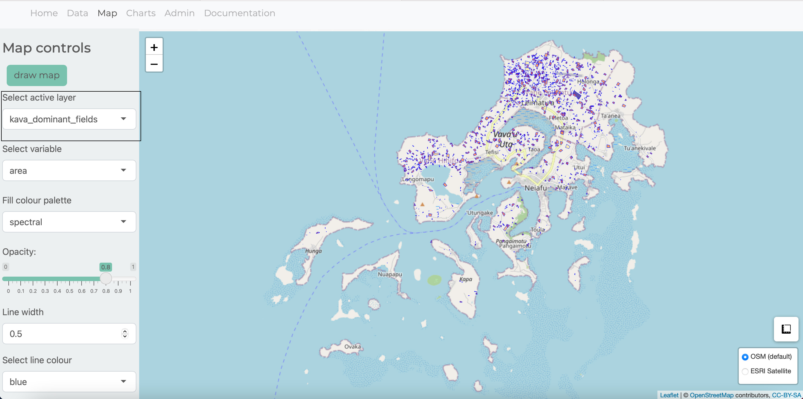

## Group-by and Summarise 

A key data reporting task is performing aggregated summaries or group-by and summarise operations. Let's demonstrate how these can be performed in maplanscape by computing the area and plant number of kava in each village. 

Above the table display, click the <em>Data: Summary</em> tab. This will change to a table display where can view aggregated summaries. 

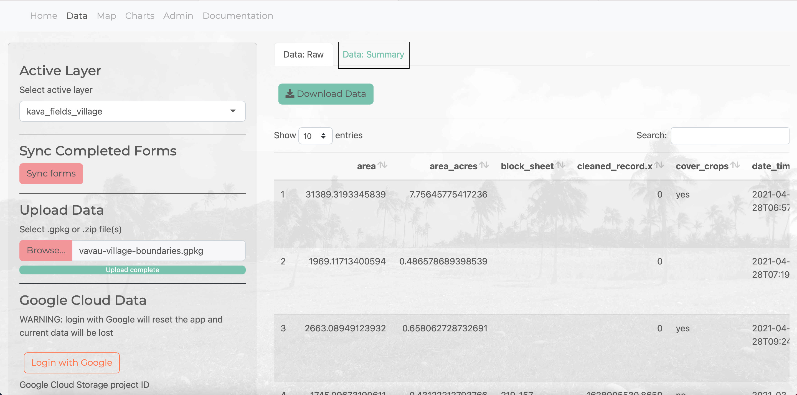

Make sure that <em>kava_fields_village</em> is selected as the <em>Active Layer</em>. Under the <em>Table Analysis</em> section in the sidebar select the <em>Summary Tables</em> option. 

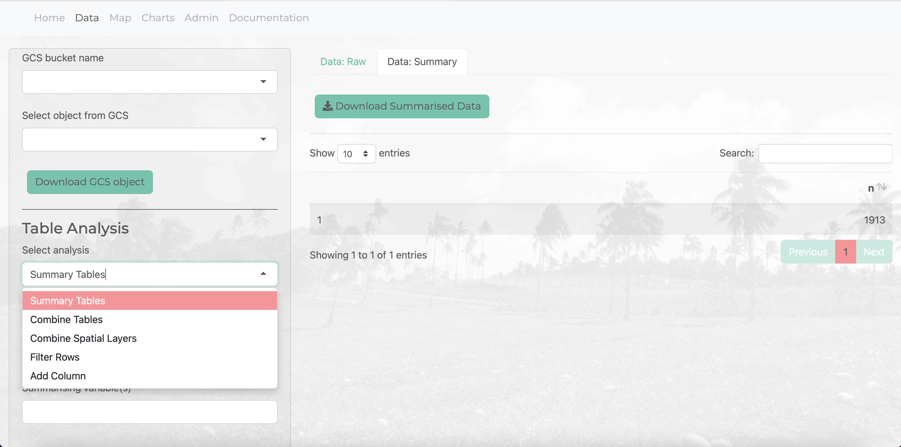

You should see two boxes labelled <em>Grouping variable(s)</em> and <em>Summarising variable(s)</em>. In the <em>Grouping variable(s)</em> box select the variables we wish to group-by. Here, that is <em>village_name</em> as we want to compute village summaries. You can type in the box to help you find the correct grouping variable.

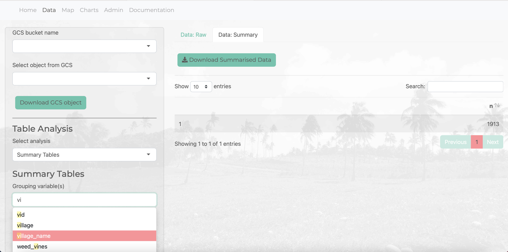

In the <em>Summarising variable(s)</em> select <em>kava_area_acres</em> and <em>kava_plant_number</em>. 


In the table display you should see that for each village in Vava'u, the mean and sum of kava area in acres and kava plant number have been computed. You can click <em>Download Summarised Data</em> to export the summary table as a csv file. You can explore changing the grouping and summary variables to create new summary tables. 

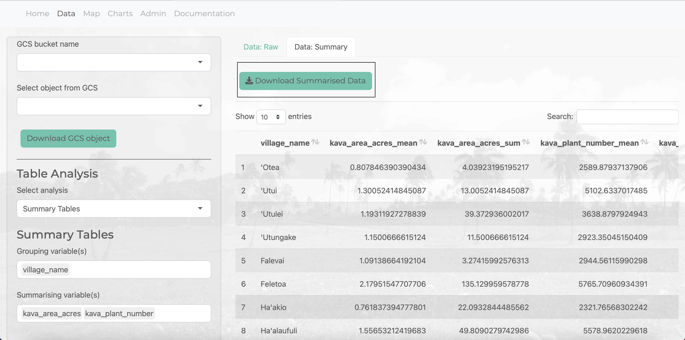

# Exploring Cropping Systems in the Map 

Let's use the <em>Map</em> tab to visualise cropping systems in each of the kava fields. Choose <em>kava_fields_village</em> as the active layer in the sidebar, <em>kava_plant_number</em> as the variable, <em>yellow-green-blue</em> as the fill colour palette, set the line width to 0.1, and the basemap in the bottom right corner of the map view to <em>ESRI Satellite</em>. Then click <em>draw map</em>. You should see something like the image below. 

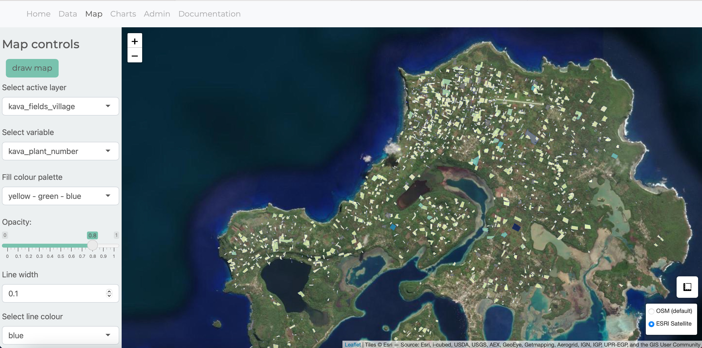

In the sidebar, scroll down, and you will see there is a check box to turn on the legend. Check this box and display the legend. You can also enter text to create a legend title.  

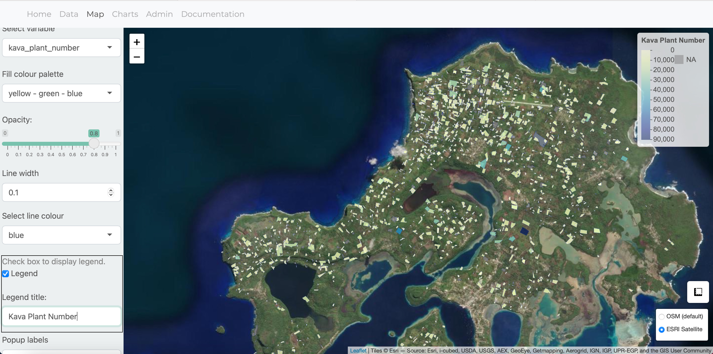

Finally, keep scrolling down the sidebar and you'll see a <em>Popup labels</em> box. Click in this box and choose variables in the layer displayed on the map that you'd like to see in a popup label for each feature. Let's select the <em>grower_status</em> variable to see if each field is subsistence, semi-subsistence, or commercial and select some kava variety variables to see what varieties are grown in each field. Click on some features on the map to explore attributes for that field. 

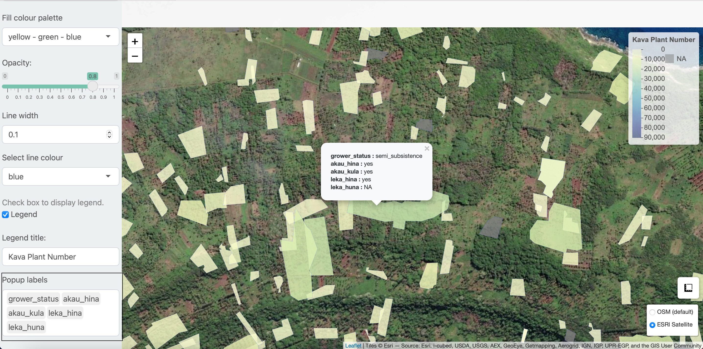

# Making Charts

There is also a <em>Charts</em> tab in maplandscape which provides tools to create charts from data in your GeoPackages. You can create histograms to visualise the distribution of a variable, scatter plots to visualise bivariate correlations and relationships, and bar plots to visualise amounts of variable per-group. 

Let's create a bar plot showing the number of kava plants in each village. In the sidebar, select <em>kava_fields_village</em> as the active layer and <em>bar plot</em> as the chart type. 

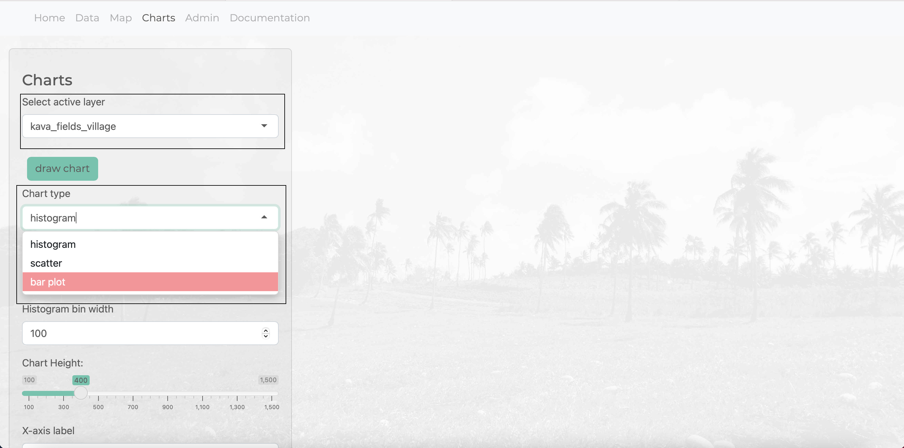

Select <em>village_name</em> as the <em>Grouping variable</em> and <em>kava_plant_number</em> as the <em>Summary variable</em>. Choose <em>sum</em> as the bar plot type and click <em>draw chart</em>. 

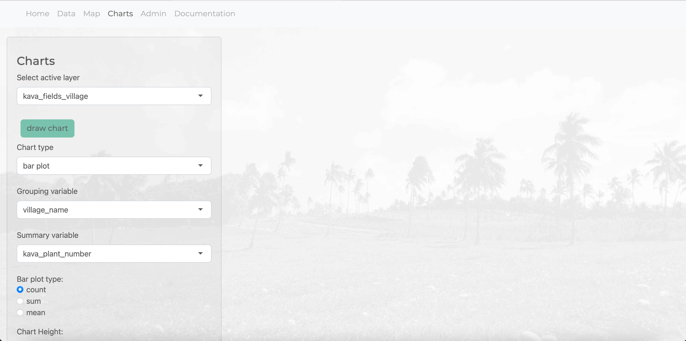

You should see a chart that looks like the image below. 

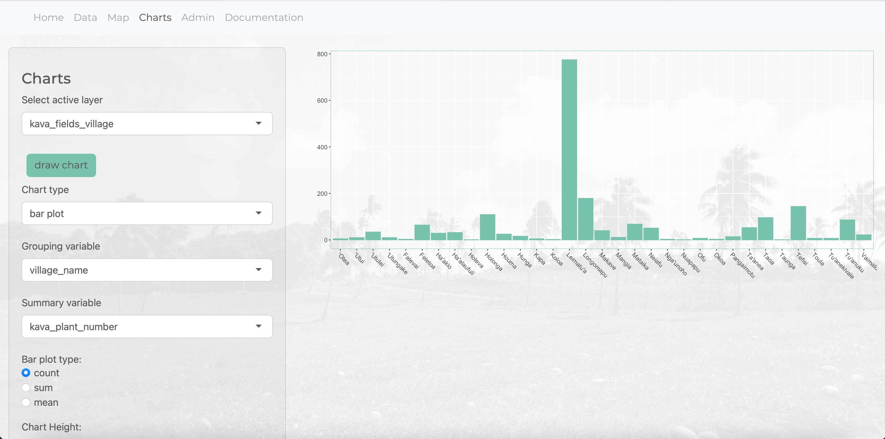

There are few extra things we can do to style the chart. Scroll down in the sidebar and change the chart's height to fill your display. 

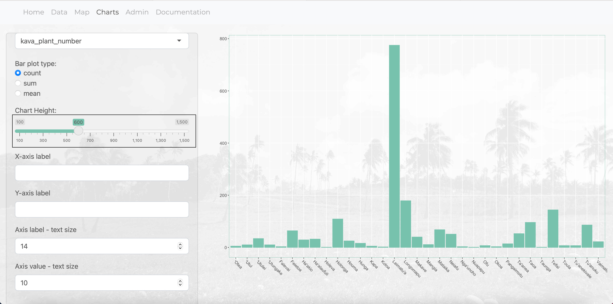

You can also create axis labels and change text font sizes. Create and X-axis and Y-axis label and change the Axis label and Axis value text size to 16. Then click the <em>draw chart</em> button. You should see a chart with axis labels in your display. You can save the chart by right-clicking on it and selecing save as image. 

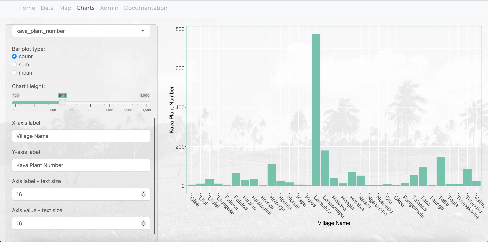

For more advanced use of maplandscape, check out the vignette on <a href="https://livelihoods-and-landscapes.com/maplandscape/articles/admin_mode.html" target="_blank">admin mode</a> to see how clean and edit your data.
