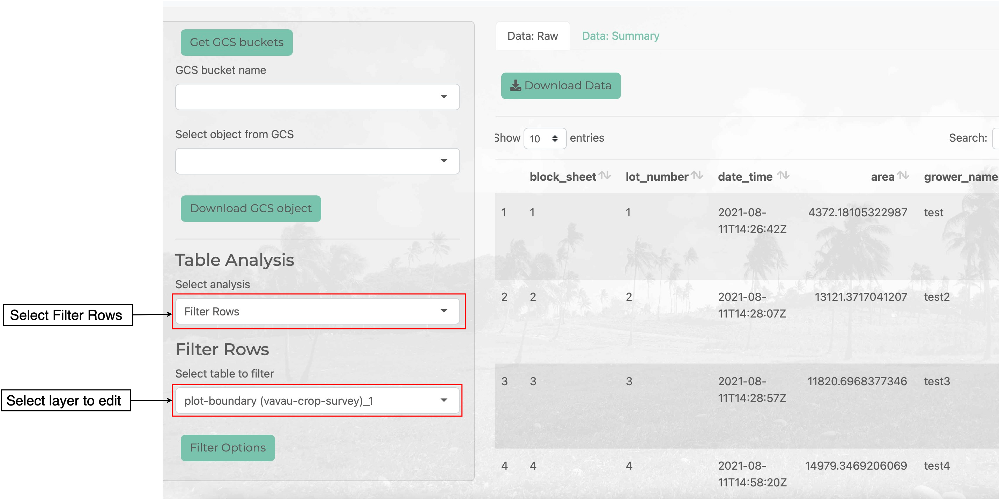
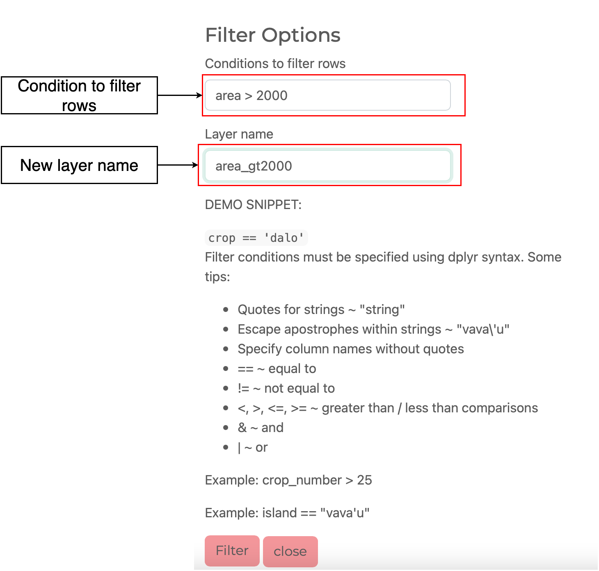
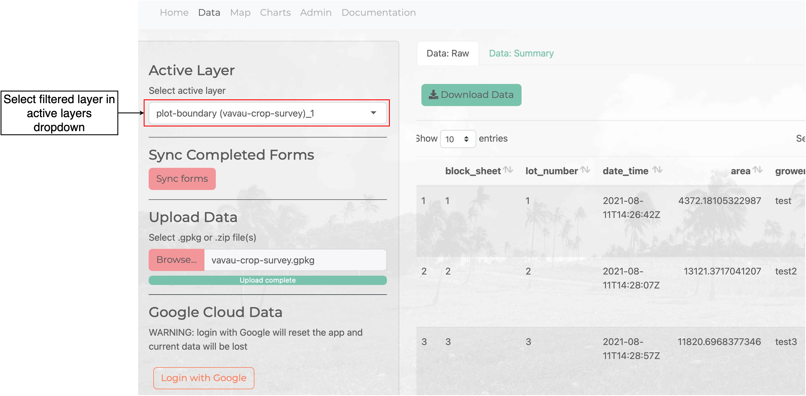

```{r, include = FALSE}
knitr::opts_chunk$set(
  collapse = TRUE,
  comment = "#>"
)
```

Filter rows from a layer based on values in existing columns using maplandscape's `filter_rows` function. This is based on dplyr's [filter](https://dplyr.tidyverse.org/reference/filter.html).

In the Data tab scroll down in the sidebar to the *Table Analysis* section and select *Filter Rows* from the dropdown list.

In the *Filter Rows* section pick the layer you want to filter rows from using the *Select table to filter* dropdown list. Click the *Filter Options* button.



Enter a condition that evaluates to TRUE to filter rows from the selected layer. Conditions should be specified using dplyr's [filter](https://dplyr.tidyverse.org/reference/filter.html) or R's syntax; for example, `area > 50` will select all rows where the `area` column has a value greater than 50. Enter a name for the layer to store the filtered rows.



Inspect the result of your filter operation by selecting the new filtered layer in the *Active Layer* dropdown list.


