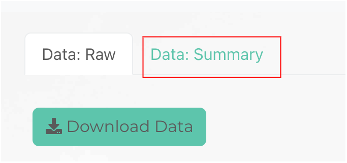
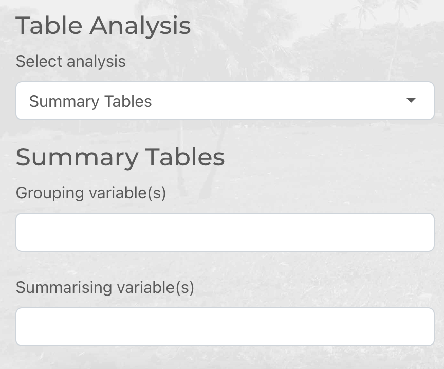
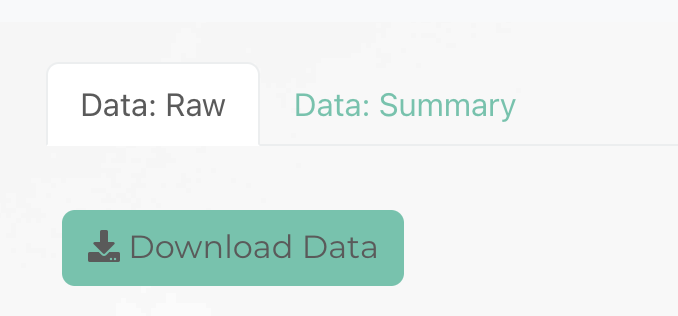
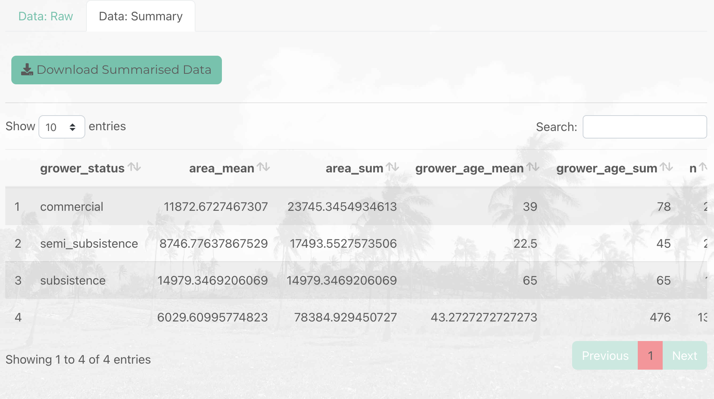

```{r, include = FALSE}
knitr::opts_chunk$set(
  collapse = TRUE,
  comment = "#>"
)
```

If you look at the top of the *Data* tab you will see two options *Data: Raw* and *Data: Summary*. You can use the *Data: Summary* tab to visualise custom summary tables of layers in a GeoPackage. The summary tables allow you to visualise the results of [`group_by` and `summarise` operations](https://r4ds.had.co.nz/transform.html#grouped-summaries-with-summarise) where summary statistics for a selection of columns are computed for a set of groups. An example, computing the area of croplands in each village (where village is the grouping variable).



Scroll down to the *Table Analysis* section of the side bar and select *Summary Tables*.



In the *Grouping variable(s)* widget select one or more columns in the active layer that describe each group that you wish to compute summary statistics for. 

In the *Summarising variable(s)* widget select one or more columns in the active layer that you wish to compute summary statistics for within each group. For categorical variables the count of observations per-group is returned and for numeric variables the mean and sum are computed. 



Click on the *Data: Summary* tab to view the summary table.



