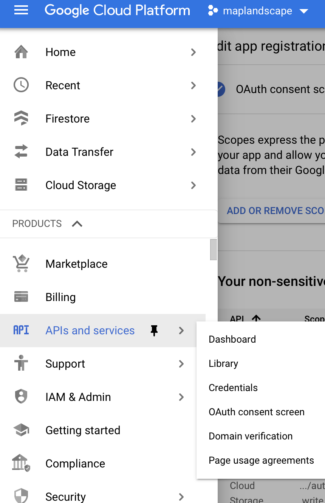
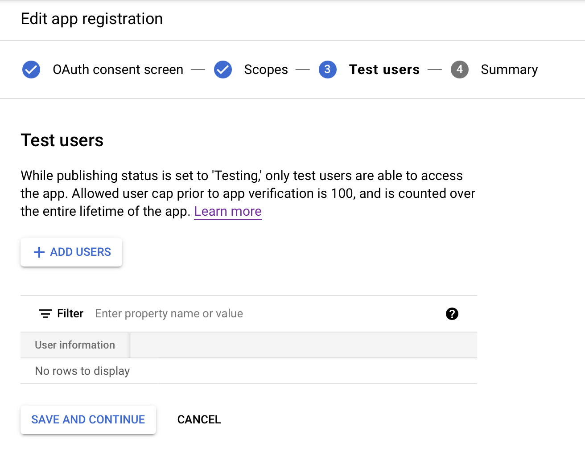
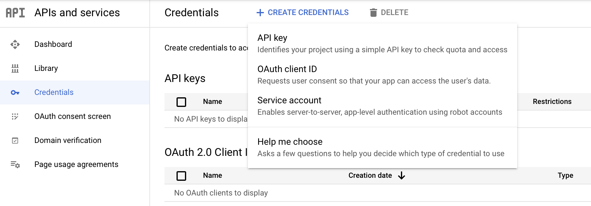
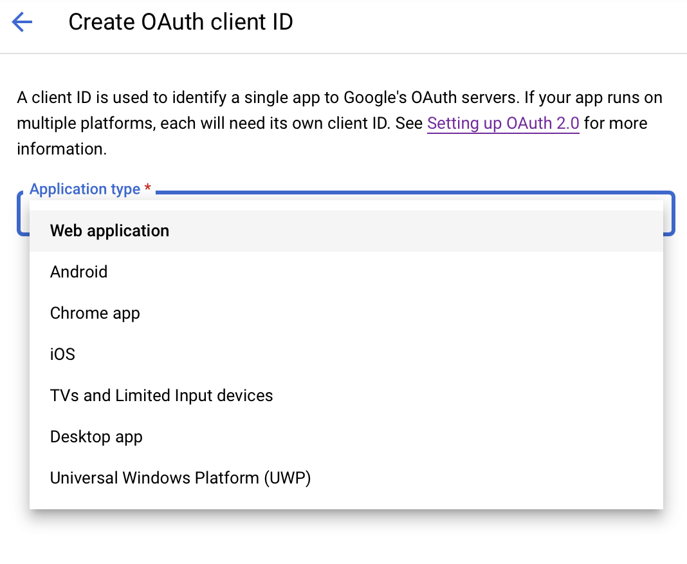

```{r, include = FALSE}
knitr::opts_chunk$set(
  collapse = TRUE,
  comment = "#>"
)
```

## OAuth2.0 on Google Cloud

This vignette demonstrates how you can make authenticated requests to query and retrieve objects from Google Cloud Storage from a Shiny application and sets you up to use functions provided in maplandscape for listing Google Cloud Storage buckets, listing objects in Google Cloud Storage buckets, and downloading (GETting) objects from a Google Cloud Storage bucket into your app instance. Google Cloud Storage APIs use [OAuth2.0](https://developers.google.com/identity/protocols/oauth2#basicsteps) for authentication

### Create OAuth2.0 Authorisation Credentials

The first stage of making authenticated requests to Google Cloud Storage APIs from a Shiny application is generating authorisation credentials used to identify the application to Google authentication servers. Read more [here](https://developers.google.com/identity/protocols/oauth2/web-server#creatingcred).

Navigate to *APIs and services* in the Google Cloud Platform menu. Select *OAuth consent screen* and fill out the required information. 



You will need to select *Cloud Storage API* as a sensitive scope. This will allow users to make authenticated requests to their Google Cloud Storage buckets and objects. 

If the app is in-development or testing phases, you can add test users. 



If you want to publish the app you will need to get it verified by Google (read more about this process [here](https://support.google.com/cloud/answer/9110914#)).


Next, head to the *Credentials* section and click *Create Credentials* and *OAuth client ID*. 



Select Application type as *Web application* and add URI (*Authorised redirect URIs*) for where you want authourised users to be redirected to (typically, an instance of a Shiny app where they can interact with their GeoPackages in Google Cloud Storage). 



## HTTR OAuth_app

Once you create your OAuth client, you will see that a Client ID and a Client Secret have been generated and you can use these to create an [OAuth app](https://httr.r-lib.org/reference/oauth_app.html). This will allow users to authenticate themselves using their Google identity (e.g. a gmail account) and make authenticated requests to their Google Cloud Storage. 

Head to the directory where you cloned the `maplandscape` package. 

```
git clone https://github.com/livelihoods-and-landscapes/maplandscape.git

cd maplandscape
```

Navigate to the app directory at:

```
cd inst/app/
```

Create a [config](https://rstudio.github.io/config/index.html) file to store your Client ID, Client Secret, and redirect URI using the following template:

```
touch config.yml
```

```
default:
  oauth_key: "<Client ID here>"
  oauth_secret: "<Client Secret here>"
  app_url: "<redirect URL here>"
```

If you want to keep your Client ID and Client Secret private you can include the `config.yml` file in `.gitignore` when using version control and public remote repositories. 

When you launch your app, the following code in the `inst/app/global.R` will be executed, reading the variables specified in the config.yml file, and creating an OAuth app that you can use within your Shiny app.

```
app <- httr::oauth_app("shiny",
                       key = config::get("oauth_key"),
                       secret = config::get("oauth_secret"),
                       redirect_uri = APP_URL
)
```

You can use this app with [httr's](https://httr.r-lib.org/reference/oauth2.0_token.html) `oauth2.0_token()` to retrieve a `token2.0()` object which will allow the Shiny app to make requests to the Google Cloud Storage API's on behalf of the authenticated user. An example of this process can be seen [here](https://gist.github.com/hadley/144c406871768d0cbe66b0b810160528) (a minimal example) and in this snipped taken from `inst/app/server.R`:

```
  ## Get token that can be used to make authenticated requests to Google Cloud Storage
  token <- reactive({

    ## gets all the parameters in the URL. The auth code should be one of them.
    pars <- shiny::parseQueryString(session$clientData$url_search)

    if (length(pars$code) > 0) {
      ## extract the authorization code
      # Manually create a token
      token <- try(
        httr::oauth2.0_token(
          app = app,
          endpoint = api,
          credentials = httr::oauth2.0_access_token(api, app, pars$code),
          cache = TRUE
        )
      )
      if ("try-error" %in% class(token)) {
        token <- NULL
      }
    } else {
      token <- NULL
    }

    token
  })
```

This generates a reactive object `token` which either has the value `NULL` when a user has not authenticated themselves to Google Cloud Storage and received an OAuth token or a value of a `token2.0()` object if authentication has been successful. Following successful authentication of a user to the Google Cloud Storage API, token can be included in HTTP requests to Google Cloud Storage API's to query or retrieve items in Google Cloud Storage buckets. This package provides functions to list and get objects from Google Cloud Storage: 

* `list_gcs_buckets` - list all buckets in Google Cloud project.
* `list_gcs_bucket_objects` - lists all objects in a Google Cloud Storage bucket.
* `get_gcs_object` - gets an object from a Google Cloud Storage bucket. 

A full list of Google Cloud Storage API methods, which can be used for interacting with Google Cloud Storage buckets and objects via HTTP requests, are listed [here](https://cloud.google.com/storage/docs/json_api/v1/objects#methods)
