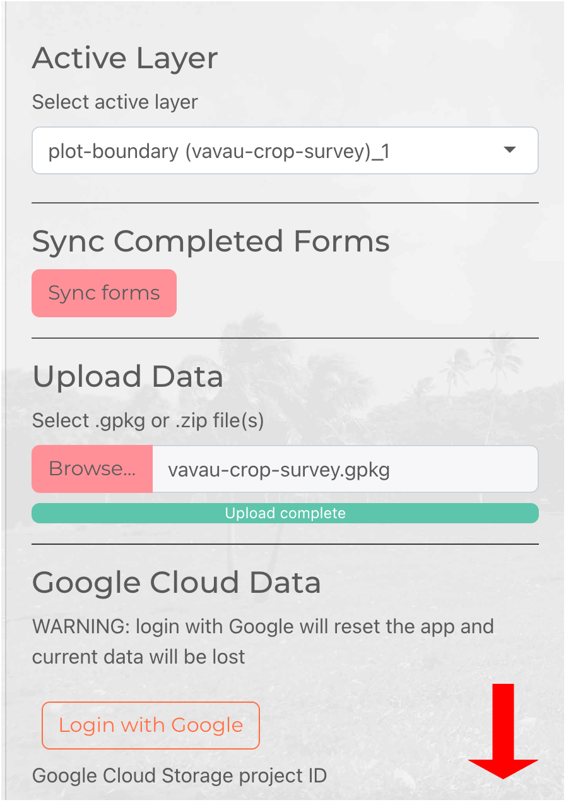
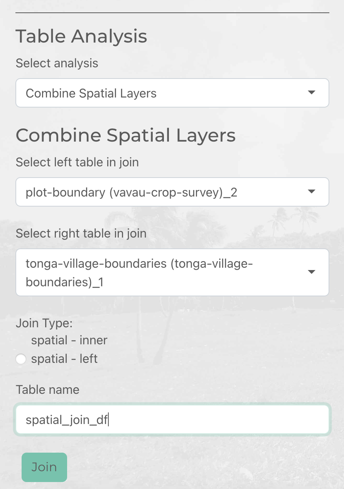
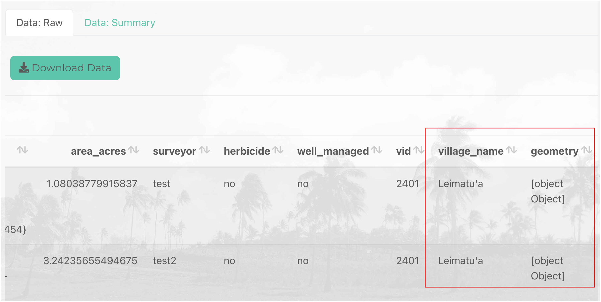

```{r, include = FALSE}
knitr::opts_chunk$set(
  collapse = TRUE,
  comment = "#>"
)
```

<em>Combine Spatial Layers</em> provides tools for performing spatial joins. A spatial join allows you to combine attributes from two spatial layers based upon the feature’s relationship in space.

A spatial join could be useful in the following scenario: you have been mapping farms using QField and have a spatial layer storing the outline of fields and attributes about each field (e.g. farmer name, fertiliser use etc.). You might want to combine your map of field outlines with another spatial layer (e.g. tax allotment, village boundaries, census boundaries). This would involve assigning attributes in your village boundary layer (e.g. village name, village id) to fields whose outline overlaps with the village extent.

In this maplandscape features are joined based on the largest intersection (largest overlap) between two features (using [sf](https://r-spatial.github.io/sf/reference/st_join.html)'s `st_join`). If 30% of a field overlapped with Village A and 70% of a field overlapped with Village B, the field would be assigned the attributes of Village B. Another way to think of this is: the field is getting the columns from the table associated with village boundaries with the values coming from the row in village boundaries table corresponding to the village with the largest overlap with the field.

The following diagram illustrates the process of performing a spatial join using the field-to-village example.


Use the <em>Table analysis</em> tools to select the <em>Combine Spatial Layers</em> option. Scroll down to the *Table Analysis* section in the side bar of the Data tab. 



You will need to have two spatial layers loaded into the app to perform a spatial join. Under the *Select left table in join* and *Select right table in join* dropdown lists you will need to specify the two spatial layers you will join together. The attributes of the *right table* will be appended to the attribute table of the *left table* - which table you select as left and right matters.

You can choose the *Join Type*. A *spatial - inner* join keeps only features in the left table that intersect with a feature in the right table. A *spatial - left* join keeps all features in the left table. 

Enter a *Table name* - this will be label for the output of the spatial join which you can select in the *Select active layer* dropdown list to explore in DataTables, web maps, or charts. 



Scroll to the top of the side bar and select the output of the spatial join in the *Select active layer* dropdown list.

You can explore the output of the spatial join in the DataTable - you should see the columns from the right table joined to the end (right) of the spatial join output. 



