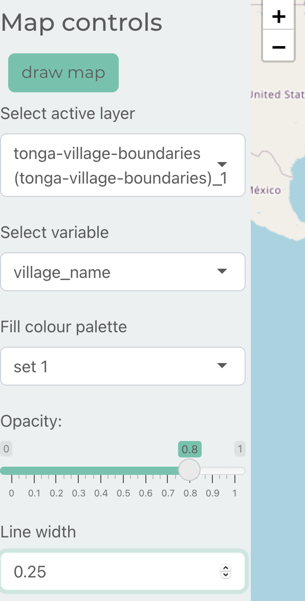
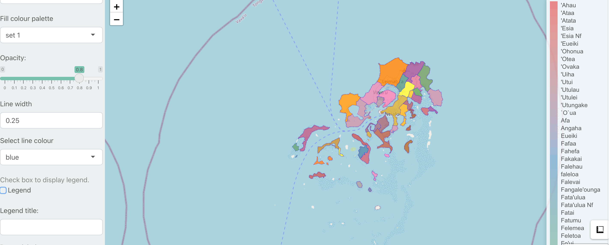
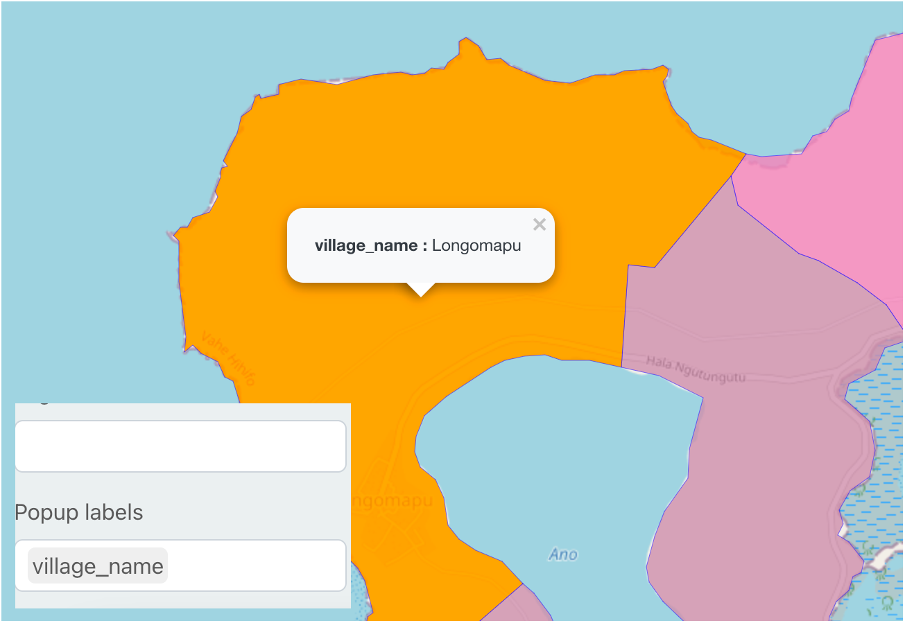

```{r, include = FALSE}
knitr::opts_chunk$set(
  collapse = TRUE,
  comment = "#>"
)
```


Under the *Map* tab are a range of tools to generate and style web maps of spatial data in GeoPackage files using [Leaflet](https://rstudio.github.io/leaflet/).


In the side bar, *Select active layer* presents a dropdown list of layers that you can render on the map. If you try to select a non-spatial layer you will get a warning. 

*Select variable* is a dropdown list of columns associated with the selected layer, the values of this column will be mapped to a colour palette when visualising features on the map. 

There are a range of other map styling options such as picking the *Fill colour palette* (refer to this [reference](https://clauswilke.com/dataviz/color-basics.html) for useful advice on choosing colour palettes), *Opacity* of features, *Line width*, and whether to display a legend. 



You can scroll down the sidebar to find more options such as whether to display a legend and to create a legend title. 



At the bottom of the side bar is a widget where you can select one or more columns from the layer to generate popup labels. When you click on a feature on the map, that feature's values for the selected columns will appear as a popup. 




